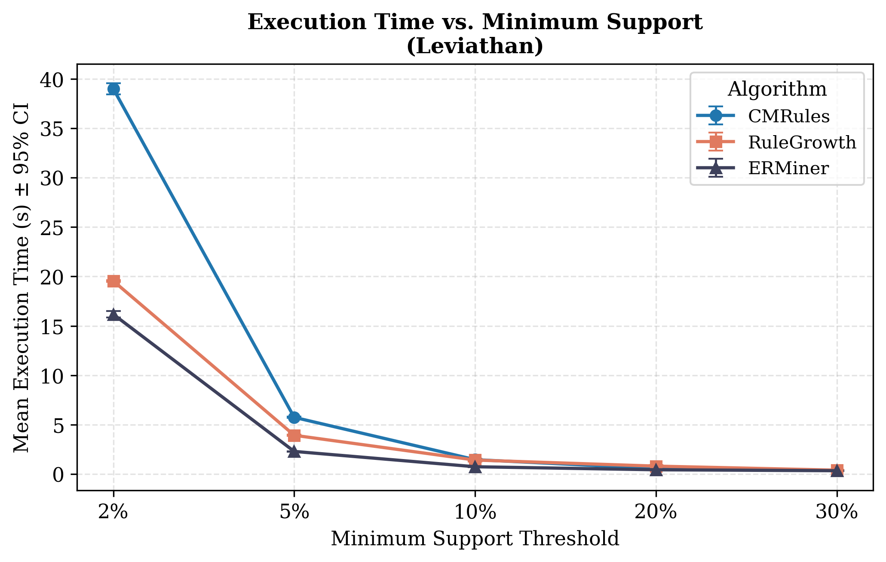
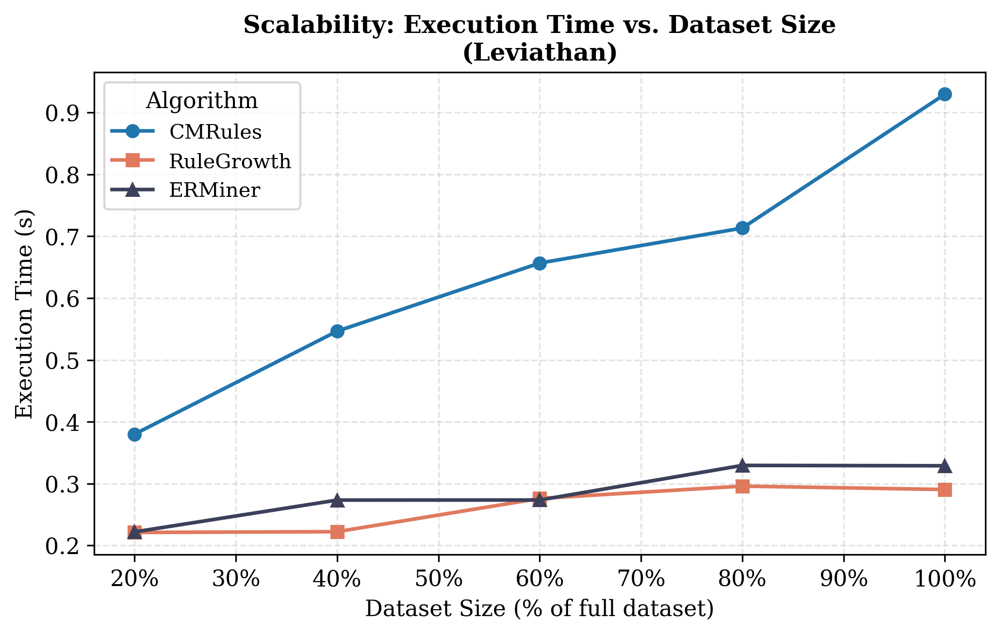
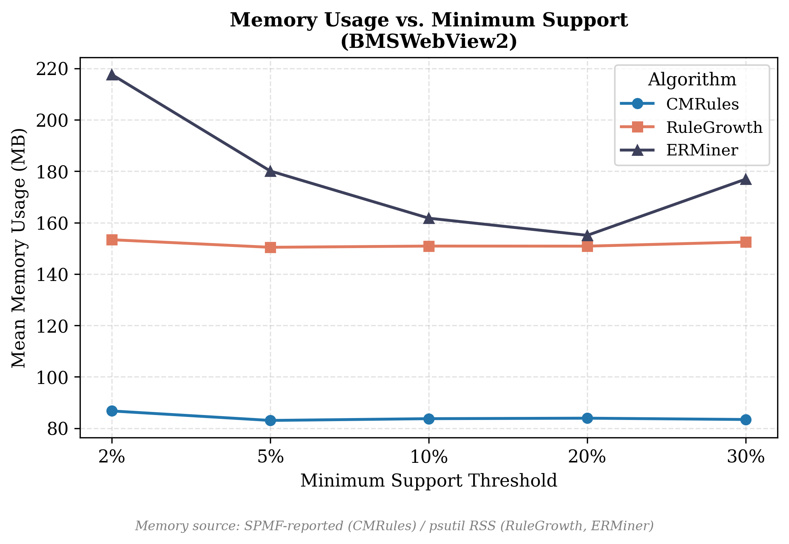

# AKM-Benchmark: Ardışık Kural Madenciliği Algoritmalarının Karşılaştırmalı Analizi

Bu proje, ardışık kural madenciliği (Sequential Rule Mining) alanında kullanılan üç temel algoritmanın (**CMRules**, **RuleGrowth** ve **ERMiner**) performansını bilimsel metodolojilerle karşılaştırmaktadır.

## Algoritmik Karşılaştırma Matrisi

| Algoritma | Arama Stratejisi | Paradigma | Veri Yapısı | Aday Üretimi |
| :--- | :--- | :--- | :--- | :--- |
| **CMRules** | Genişlik-öncelikli | Üret-ve-test | Yatay liste | Var |
| **RuleGrowth** | Derinlik-öncelikli | Örüntü büyütme | Oluşum listesi | Yok |
| **ERMiner** | Denklik sınıfı | Sınıf-tabanlı | SCM + sınıf | Yok (SCM filtreli) |

## Veri Kümesi Karakteristikleri

Deneyler, yapısal olarak birbirinden farklı iki gerçek dünya veri kümesi üzerinde gerçekleştirilmiştir.

| Özellik | BMSWebView2 | Leviathan |
| :--- | :--- | :--- |
| **Dizi Sayısı** | 77.512 | 5.834 |
| **Farklı Öğe Sayısı** | 3.340 | 9.025 |
| **Ortalama Dizi Uzunluğu** | 4,62 | 33,81 |
| **Veri Yapısı** | Seyrek, kısa diziler | Yoğun, uzun diziler |

## Deney Sonuçları ve Görselleştirmeler

Tüm performans grafiklerine ve analiz görsellerine `figures/` klasörü altından erişebilirsiniz.

### 1. Çalışma Süresi (Execution Time)
Yoğun veri kümesinde (Leviathan) ERMiner ve RuleGrowth, düşük destek eşiklerinde CMRules'a karşı belirgin bir hız avantajı sergilemektedir.

### 2. Ölçeklenebilirlik (Scalability)
Veri kümesi boyutu arttıkça tüm algoritmaların çalışma süresi yaklaşık doğrusal bir artış göstermektedir.

### 3. Bellek Kullanımı (Memory Usage)
ERMiner, özellikle yoğun veri kümelerinde SCM yapısının getirdiği sabit maliyet nedeniyle daha yüksek bellek profili çizmektedir.

## Temel Bulgular

* **Hız:** RuleGrowth ve ERMiner, CMRules'a göre belirgin şekilde daha hızlıdır. Leviathan veri kümesinde ERMiner en hızlı sonucu vermiştir.
* **Bellek:** ERMiner düşük destek eşiklerinde en yüksek belleği kullanırken, RuleGrowth en dengeli hız-bellek profilini sunar.
* **Tamlık:** Üç algoritma da test edilen tüm parametrelerde tamamen özdeş kural kümeleri üretmiştir.
* **Öngörülebilirlik:** Seyrek ve kısa dizili veri kümelerinde (BMSWebView2) kural üretilemeyeceği, veri istatistikleri üzerinden önceden tespit edilebilmektedir.

## Senaryo Bazlı Algoritma Önerileri

| Senaryo | Önerilen Algoritma |
| :--- | :--- |
| **Yoğun veri kümesi ve yeterli bellek** | ERMiner |
| **Bellek kısıtlı ortamlar** | RuleGrowth |
| **Uygulama sadeliği öncelikli** | CMRules |
| **Seyrek veya küçük veri kümeleri** | Herhangi biri |

---
*Bu çalışma Bursa Teknik Üniversitesi Veri Madenciliği dersi kapsamında hazırlanmıştır.*
